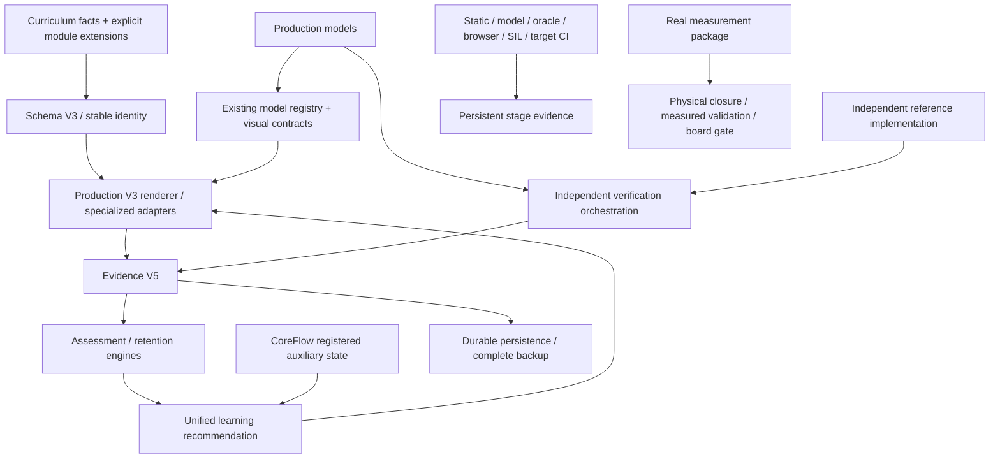

# Repository architecture map

Audit baseline: `74797e5eef24b72fa21284d092cdfeb7494f62a1` (PR #43). This map describes executable ownership, including boundaries between models; it does not declare a new runtime generation. The complete 513-file tree is recorded in [architecture-inventory.json](architecture-inventory.json).

## Ten-minute orientation

Circuit-Simulation teaches digital power engineering. A newcomer starts with the eight plain-language exercises, then uses Module 19's eight causal layers. Module 15 supplies unknown-system diagnosis, Module 16 mathematical lenses, Module 17 topology transfer and Module 18 the common control grammar. Existing modules 0–14 provide component/application depth.

The product is a learning workbench; it is not a hardware certificate. Models generate simulated observations, independent verification checks their declared contracts, firmware compilation produces a reference image, and physical captures are still required for a board claim.

## A. User flow

```mermaid
flowchart LR
 Home[Home / plain workspace] --> Beginner[Predict / operate / explain]
 Beginner --> Guided[Module 19: eight causal layers]
 Guided --> Engineering[Model / firmware / timing lenses]
 Engineering --> Debug[Module 15: diagnose unknown system]
 Debug --> Transfer[Module 17: unseen topology]
 Transfer --> Capstone[Module 19: integration]
 Capstone --> Evidence[Formal assessment / board evidence]
 Evidence --> Review[Due retention]
```



| Arrow / responsibility | Actual files |
|---|---|
| Home → Beginner | `index.html`, `learn.html`, `assets/learning/workspace-ui.js`, `workspace-core.js`, `assets/beginner-lessons.js`, `plain-course-core.js` |
| Beginner → Guided / resume | `assets/learning/unified-learning.js::next/route`, `core-flow-v1.js::layers/snapshot`, `learning-bridge.js` |
| Guided → Engineering | `19_c2000_buck_firmware_lab/learning-p2.js`, `layer-live.js`, `precision-teaching-v1.js`; `assets/learning/guided-*-models-v1.js` |
| Engineering → Debug | `unified-learning.js::tasks.repair`, `15_power_capstone/lab_multifault.html`, `assets/repair-training-core.js`, `assets/engineering-sandbox-core.js` |
| Debug → Transfer | `17_power_topology_control/index.html`, `app.js`, `p5-transfer.js`, `assets/learning/topology-transfer-v1.js` |
| Transfer → Capstone / Evidence | `core-flow-v1.js`, `19_c2000_buck_firmware_lab/outcome-ui.js`, `physical-closure-ui.js`, `board-evidence-ui.js` |
| Evidence → Review | `outcome-session-v1.js`, `learning-assessment.js`, `unified-learning.js::dueReview/next` |

The default does not automatically run all arrows. Registered task routing and explicit learner selection currently connect separate surfaces. That remaining product boundary is recorded in the audit, not hidden by this diagram.

## B. Physics flow

`Vin → switching → L/C state → Vout/Iout → load`

| Executable path | Owner and scope |
|---|---|
| Fixed duty → periodic inductor current → output ripple | `assets/training-experiments-core.js::buck/buckConfig`. Ideal diode Buck, steady state, CCM/BCM/DCM, small ripple; ESR affects ripple only. Used by workspace, shared case and training instrument. |
| Command → switched plant → load step → physical trace | `assets/engineering-sandbox-core.js::simulateSystem`. Module 15 coupled causal kernel with ADC, cascaded control, timing, state and faults. |
| Teaching layer → averaged plant | `assets/learning/guided-layer-models-v1.js`; independent teaching lens, not interchangeable with the switched kernel or target firmware. |
| Firmware control → averaged plant | `19_c2000_buck_firmware_lab/firmware/host_sil.c`, `hil/hil-models.js`. Distinct verification implementations under the C control contract. |
| Operating point → frequency response | `17_power_topology_control/app.js`, `assets/learning/control-engineering-v1.js`, `model-contracts-v1.json`. Small-signal / FHA assumptions are explicit. |

Multiple Buck implementations are not automatically duplicates: steady-state ripple, switched causal simulation, linearized frequency response and independent SIL/HIL serve different contracts. Merging their outputs without a declared adapter is a truth conflict.

## C. Signal flow

`physical V/I → sensor → analog conditioning → ADC pin → counts → engineering units`

| Arrow | Actual owner |
|---|---|
| Sensor / divider / quantization | `assets/learning/engineering-models.js::calculateCurrentChain/calculateDivider/quantizeAdc`; registry IDs `adc-quantization`, `adc-divider` |
| Conditioning limits | `12_opamp_slew_rate/*`, `assets/learning/opamp-*.js`; AFE Module 9 |
| Sample at actual plant time → counts → feedback | `assets/engineering-sandbox-core.js::adcSample/simulateSystem` |
| Didactic sampling lens | `assets/learning/guided-layer-models-v1.js::sensingSample`; does not replace the whole machine |
| Target ADCRESULT → Vin/Vout/iL | `19_c2000_buck_firmware_lab/firmware/f2838x_target.c`; board channel/scaling/acquisition provenance required |
| Independent reference agreement | `assets/learning/lab-oracles.js`, `lab-verification-contracts.js`, module `*-verification.js` |

## D. Control flow

`r → e = r − measured y → C(z) → actuator command → PWM → plant → y → sensing`

The generic Module 15 kernel implements voltage PI → limited current reference → current PI → duty. `simulateSystem` consumes the quantized measurement, not a separate UI answer. C firmware `BuckControl_tick()` owns the target reference controller and its `vin`, `iL`, cadence and soft-start semantics. `control-engineering-v1.js` owns loop composition, controller discretization, ZOH and pure-delay factors for Module 18; its generated arithmetic template is not production firmware.

Actual arrows: `engineering-sandbox-core.js::{adcSample,piStep,simulateSystem}` and `firmware/buck_control.{c,h}`; visual adapters: `engineering-sandbox-ui.js`, `19_c2000_buck_firmware_lab/lab.js`, `layer-live.js`, `18_control_unification/engineering-workbench.js`.

## E. Time flow

`PWM ZERO → ADC SOC → sample → ADC complete → ISR → calculation → shadow register → next eligible PWM update`

- Coupled teaching events: `engineering-sandbox-core.js::simulateSystem/timingWindow`.
- System timing lens: `power-system-models-v1.js::timing`; timing analytical owner: `control-engineering-v1.js`.
- Core teaching: `guided-power-models-v1.js`, `19_c2000_buck_firmware_lab/lab.js`.
- Peripheral ownership: `firmware/f2838x_target.c` (ePWM1, ADCA SOC/interrupt, CMPA shadow at ZERO).
- Measured acceptance: `control-validation-v1.js`; physical timestamps must satisfy its strict eligibility rule.

Computing at a deadline is not computing before it. `docs/unified-causal-kernel.md` contains a stale `<=` description at this baseline; the strict production timing behavior and tests take precedence. Correct the document without relaxing the code.

## F. Safety / authority flow

```text
RUN AND command fresh AND sensing valid AND calibration valid
AND peripherals ready AND no fault
    → software PWM authority

CMPSS → XBAR → DCAEVT1 / Trip Zone → independent PWM veto
```

`firmware/buck_control.c` owns the software permission. `f2838x_target.c` owns producer-published sequence / clear token, ADC overflow invalidation and hardware fault mirroring. `BuckTarget_publishCommand()` owns freshness; the ADC ISR cannot create a heartbeat. `BUCK_BOARD_CALIBRATION_VALID` defaults to 0. `hil/hil-models.js` tests corresponding deterministic invariants; it is not board measurement.

The Module 15 generic state exercise has a deliberately smaller state contract. It must not be advertised as a bit-identical target authority implementation.

## G. Evidence flow

`prediction → operation → measurement → explanation → independent verification → evidence grade → transfer → retention`

| Arrow | Canonical implementation |
|---|---|
| Prediction / machine interaction / immutable report | `learning-evidence.js` V5 containers; `tutor.js`, `learning-v3.js` adapters |
| Production output ↔ independent reference | `lab-oracles.js`, `lab-verification-contracts.js`, module verification extensions |
| Reasoning rubric → grade | `learning-assessment.js`, `verification-v7.js`, `verification-v8.js` |
| Unseen question → first attempt → retention | `learning-assessment.js`, `assessment-v8.js`, `outcome-session-v1.js`, `outcome-core8-instrument-v2.js` |
| Anonymous learner aggregates | `outcome-study-v1.js`, `tools/learning/summarize-outcome-study.mjs`; always observational, not causal proof |
| Real captures → board gate | `physical-board-closure-v1.js`, `control-validation-v1.js`, `board-evidence-v1.js`, `tools/board/*` |

Practice completion, CoreFlow completion, formal PRE/POST/retention and board verification are different dimensions. Unification reads these owners; it must not sum them into a new mastery score.

## H. Software / ownership flow



| Domain | Canonical owner | Consumers / allowed extensions |
|---|---|---|
| Curriculum facts | `curriculum.js` + existing `*-module(s).js` extensions | Schema V3, V3 renderer, tutor, assessment coverage |
| Stable identity | `curriculum-schema-v3.js` | Evidence aliases, normalized lesson/lab/fault IDs |
| Production calculation | `engineering-models.js` and named specialized model owners above | Registry/adapters; no formulas added to the shell |
| Model metadata | `model-registry.js`; quantitative Module 17 visual metadata delegated to `model-contracts-v1.json` | Renderer, model audit; preserve delegation rather than copying metadata |
| Independent acceptance | `lab-oracles.js` + verification contracts/extensions | Never call production implementation from reference functions |
| Durable learning | `learning-evidence.js` (`circuit-learning-state-v5`) | Sole backup/migration owner |
| Core path lifecycle | `core-flow-v1.js` (`circuit-core-flow-v1`, registered with Evidence) | Existing auxiliary contract; do not create another progress store |
| Cross-page next step | `unified-learning.js` | `learning-bridge.js`, workspace, map; preserve due-review priority |
| Rendering | `learning-v3.js` for advanced generic pages | `workspace-ui.js`, Module 19 / simulator adapters have specialized rendering scope |
| Term meaning | `learning-glossary.js` with curriculum aliases | Plain explanations and engineering terminology |
| Hardware verdict | Board/closure/control-validation owners | Shell may show exact verdict, never infer it from CI success |

## Module inventory

| Module | Role / principal calculation or truth owner |
|---|---|
| 0 Buck | Steady ripple and waveform pages; `engineering-models.js`, training Buck, independent Buck oracle |
| 1 ADC | Quantization/divider/current reconstruction; engineering models + independent ADC reference |
| 2 topology basics | Switching states and safety concepts; page-output/state-invariant verification |
| 3 FOC | Clarke/Park/SVPWM teaching; separate motor plant assumptions |
| 4 PI | PI / Bode teaching; generic discrete model and page-output reference |
| 5 SPI | Frame/FIFO/mode; timing model and independent service-rate reference |
| 6 10 µs | Deadline budget; page calculation / independent critical-path acceptance |
| 7 BMS | Cell/state/contactors; its own safety policy, never reuse Buck re-arm thresholds |
| 8 AD5543 | DAC mapping; device-specific arithmetic reference |
| 9 AFE | Signal conditioning and phase/power; model boundary differs from ADC-only lens |
| 10 ACMC | Cascaded power system teaching and protection; generic sanitized system context |
| 11 DDS | Phase accumulator and power metrics; engineering models + page verification |
| 12 op amp | Dynamic slew/settling and DC reasoning; opamp models/oracles |
| 13 sync | ADC/PWM/ISR timing; power-firmware model/verification extensions |
| 14 protection | Trip/state/recovery; power-firmware model/verification extensions |
| 15 debug | Coupled causal kernel, DMA/state/multifault/code trace, repair training |
| 16 transforms | Mathematical lenses, analytical invariants and independent extension |
| 17 topology | Plant-specific contracts and existing topology-transfer engine |
| 18 control | Loop grammar, controller compiler, measurement correlation; provenance separate |
| 19 capstone | Normal causal chain, C controller, SIL, deterministic HIL, TI image, physical evidence |

## Baseline and rollback

Local static validation: 513 files, PASS with one pre-existing tutor warning in Module 6. Local Node: 315/315 PASS. Exact baseline [CI run](https://github.com/linwuyen/Circuit-Simulation/actions/runs/34297652799): Windows/Linux, 229 browser PASS / 3 skipped, Host SIL, TI compile and Flash link PASS. Artifact `c2000-buck-f2838x-flash-image` ID `10083739958`, archive digest `sha256:d156e9b9a579a62361e035acdb326c77c23cc6524c73217ac05640e1ab84a4e6`.

Physical closure / measured control / board evidence: **BLOCKED for an actual board**, absent real package/captures. Contract tests passing is not physical PASS. Learner improvement: **NOT_ESTABLISHED**, no human cohort supplied.

The first integration commit is documentation-only. Subsequent logical changes must be separately revertible; baseline PR #43 remains a known rollback point. Unpublished alternative teaching-model/UI prototypes are excluded because they introduce a second model/assessment interpretation before canonical integration.
